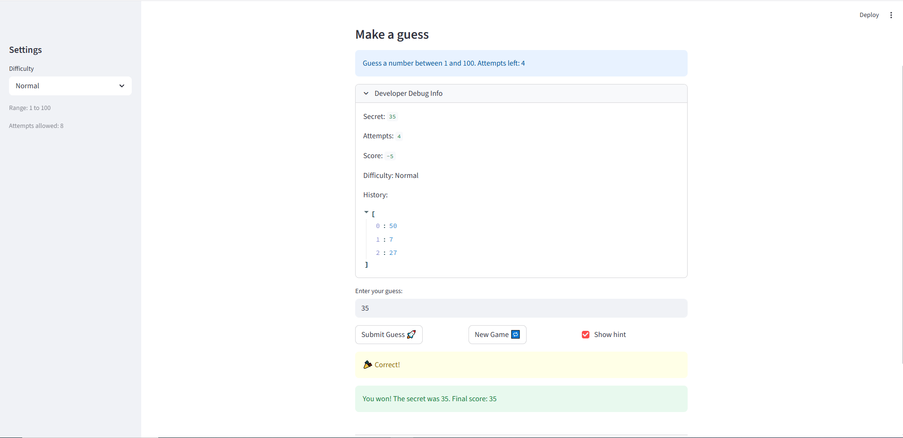
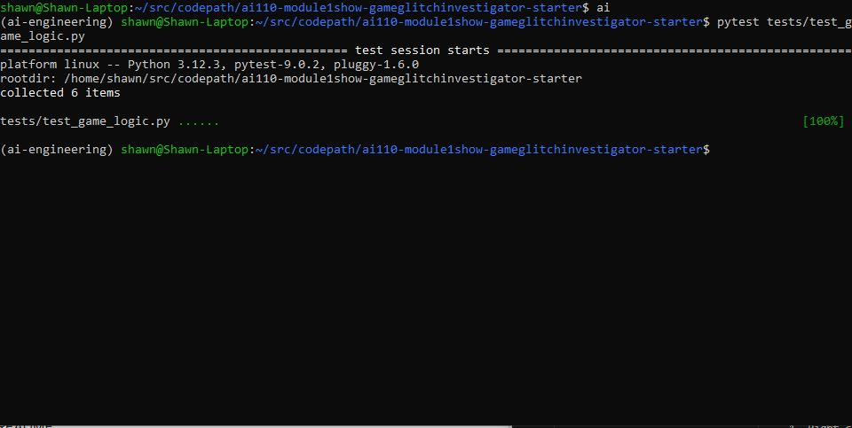

# 🎮 Game Glitch Investigator: The Impossible Guesser

## 🚨 The Situation

You asked an AI to build a simple "Number Guessing Game" using Streamlit.
It wrote the code, ran away, and now the game is unplayable.

- You can't win.
- The hints lie to you.
- The secret number seems to have commitment issues.

## 🛠️ Setup

1. Install dependencies: `pip install -r requirements.txt`
2. Run the broken app: `python -m streamlit run app.py`

## 🕵️‍♂️ Your Mission

1. **Play the game.** Open the "Developer Debug Info" tab in the app to see the secret number. Try to win.
2. **Find the State Bug.** Why does the secret number change every time you click "Submit"? Ask ChatGPT: *"How do I keep a variable from resetting in Streamlit when I click a button?"*
3. **Fix the Logic.** The hints ("Higher/Lower") are wrong. Fix them.
4. **Refactor & Test.**
   - Move the logic into `logic_utils.py`.
   - Run `pytest` in your terminal.
   - Keep fixing until all tests pass!

## 📝 Document Your Experience

- [x] Describe the game's purpose.
      *A number guessing game where the player picks a difficulty level, gets a limited number of attempts, and uses High/Low hints to find the secret number.*

- [x] Detail which bugs you found.
      *The hints were backwards — guessing too high told you to go higher. The secret was silently converted to a string on even-numbered attempts, breaking numeric comparisons. And the New Game button didn't reset the game status, so a finished game was stuck until you refreshed the browser.*

- [x] Explain what fixes you applied.
      *Fixed the hint logic in check_guess, removed the string coercion so comparisons always use integers, moved all game logic from app.py into logic_utils.py, and added st.session_state.status = "playing" to the New Game reset.*

## 📸 Demo

## 🚀 Stretch Features

- [ ] [If you choose to complete Challenge 4, insert a screenshot of your Enhanced Game UI here]
### Challenge 1: Advanced Edge-Case Testing
*I used GitHub Copilot to generate three edge-case tests to ensure the game logic is robust against unexpected user input (large numbers, decimals, and non-numeric strings).*

